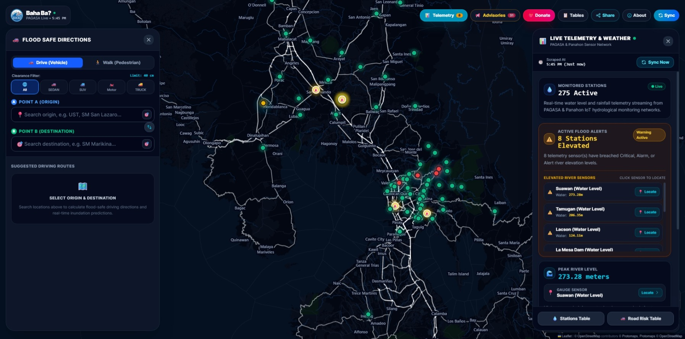

# 🌊 Bahaba (Baha ba?) — Real-Time Flood Monitoring, Navigation & Hazard Solver

> *"Baha ba?"* — Tagalog for **"Is It Flooded?"**



[](https://nextjs.org/)
[](https://react.dev/)
[](https://www.typescriptlang.org/)
[](https://tailwindcss.com/)
[](https://www.mongodb.com/)
[](https://leafletjs.com/)
[](https://web.dev/progressive-web-apps/)
[](LICENSE)

**Bahaba** is an open-source, hyper-local flood monitoring, hazard prediction, turn-by-turn navigation platform, and official social bulletin hub built for Metro Manila and the Philippine river basins. It ingests live hydrological and meteorological telemetry from the **DOST-PAGASA Panahon API (AWS, River Basin Water Levels & Rain Gauges, Synoptic Stations, Cyclone Tracking)**, scrapes real-time official bulletins and news advisories (MMDA, NDRRMC, PAGASA, and news networks), evaluates road inundation depths using hydro-predictive heuristics and machine learning models, and computes flood risk along turn-by-turn **Driving** and **Walking** routes with 1-click external navigation launchers (**Google Maps**, **Waze**, and **Apple Maps**).

---

## 🌟 Key Features

### 📱 Progressive Web App (PWA) & Offline Capabilities
- **Installable Everywhere**: Installable as a standalone app on iOS (Safari Add to Home Screen), Android (Chrome install prompt), Windows, and macOS.
- **Service Worker & Manifest**: Pre-configured `/sw.js` with background caching for critical app assets, vector map resources, icons, and dynamic runtime caches.
- **Smart Install Prompt (`InstallPrompt.tsx`)**: Contextual banner prompting users to install the web app for fast one-tap access during weather emergencies.

### 🚗 Turn-by-Turn Flood-Aware Route Solver & Map Launchers
- **OSRM Multi-Route Optimization**: Discretizes routes into ~300m sub-segments, evaluating flood depth, soil saturation, and road elevation to compare **Safest** vs. **Fastest** corridors.
- **Vehicle Clearance & Passability Engine**: Real-time passability assessment tailored to vehicle types:
  - **Sedan / Hatchback**: 15 cm clearance (caution at 8 cm)
  - **SUV / Crossover**: 25 cm clearance (caution at 15 cm)
  - **Motorcycle / Scooter**: 12 cm clearance (caution at 6 cm, hydroplaning hazard)
  - **4x4 Pickup / Truck**: 40 cm clearance (caution at 25 cm)
- **Start Travel Modal (`StartTravelModal.tsx`)**: Direct 1-click launch into native navigation apps:
  - 🚗 **Google Maps**: Turn-by-turn driving or walking directions.
  - 🚙 **Waze**: Direct GPS navigation with live traffic integration.
  - 🍎 **Apple Maps**: Native iOS Apple Maps routing.
- **Traffic Congestion & Delay Modeling**: Estimates flood-induced bottleneck delays and crawl speeds, categorizing traffic into Smooth, Moderate, Heavy, and Standstill Gridlock.
- **Pedestrian Walkability & Health Hazards**: Evaluates footpath wading slowdowns, generates **DOH Leptospirosis infection warnings**, and flags **submerged open manhole / suction drain hazards**.

### 🚨 Live Multi-Source Advisory Wall & Dynamic NLP Engine
- **Multi-Source Scraping & Social Bulletins**: Background worker (`services/advisory-scraper`) monitoring government authorities (`@MMDA`, `@NDRRMC_OpCen`, `@dost_pagasa`) and accredited news outlets (`@gmanews`, `@ABSCBNNews`, `@News5PH`, `@inquirerdotnet`, `@rapplerdotcom`, `@manilabulletin`).
- **Modular NLP & Classification Pipeline**:
  - Distinguishes active roadway inundation from project proposals, commentary, or municipal announcements.
  - Automatically rejects foreign disaster reports (e.g., Nepal, Spain, Bangladesh floods).
  - Multi-location parsing (`locationPins`) extracts dozens of distinct geographic intersections from compound municipal summaries.
  - Classifies depths into `GUTTER`, `KNEE`, `WAIST`, `CHEST / ROOF`, or `SUBSIDED`.
- **Dynamic Geocoding & Hotspot Matching**:
  - OpenStreetMap Nominatim geocoding with strict 1 req/sec rate-limiting, query sanitization, and caching.
  - Offline fallback against an extensive dictionary of Philippine flood hotspots and highway intersections (`hotspots.ts`).
- **Live Advisory Wall (`AdvisoryWallModal.tsx`) & Map Overlays**: Browse live advisories with attached photo media, passability badges, and click to fly directly to the map pin. Map pins auto-hide after 6 hours and expire after 24 hours in the database.

### 📡 DOST-PAGASA Panahon Ingestion & Hydrology Engine
- **Direct Panahon API Consumption**: Ingests telemetry nationwide from DOST-PAGASA Panahon (`https://www.panahon.gov.ph`):
  - **Automated Weather Stations (AWS)**: 1-hour and 24-hour rainfall accumulation, temperature, heat index, relative humidity, pressure, and wind vectors.
  - **River Basin Hydrology**: Real-time river water levels in meters ($m$) and catchment rain gauges ($mm$) across major Philippine river basins (Pampanga, Agno, Bicol, Cagayan, Pasig-Marikina, etc.).
  - **Synoptic Weather Stations**: Surface observations, 3-hour precipitation, MSLP, and weather condition codes.
  - **Tropical Cyclone Track Tracking**: Live cyclone coordinates, categorization (TD/TS/STS/TY/STY), and forecast track radii.
- **Pluvial-Primary Urban Modeling**: Calibrated to Metro Manila urban hydrology where road surface flooding is primarily pluvial (drainage exceedance) rather than river overflow:
  - **Soil Saturation Index (SSI)**: Logistic decay model ($SSI = 1 - e^{-0.019 \times \text{Rain}_{24h}}$).
  - **Surface Water Depth Calculation**: Accounts for urban runoff coefficients (0.8), base storm drain capacities (10–32 mm/hr), low-elevation ponding multipliers (1.5× for $\le 3.0\text{m}$), and 10-minute rainfall intensity spikes.
  - **Fluvial Riverbank Surge**: Dynamically adds overflow depth for roads within $\le 500\text{m}$ of river gauges at ALARM or CRITICAL stage.
  - **Machine Learning Inference**: ONNX Runtime integration loading trained XGBoost flood classification models with automatic heuristic fallback.
  - **UP Project NOAH Integration**: Return-period flood hazard classification (5-yr, 25-yr, 100-yr) coupled with DEM road elevation.

### 🎨 Interactive Dark Map, Bottom Drawer & Social Share
- **Leaflet.js + Protomaps PMTiles / CartoDB Dark Matter**: High-performance dark canvas with pulsating station radar indicators and responsive mobile flood legends.
- **Continuous Route Overlay**: Displays base driving/walking polyline with high-contrast highlighted overlays on flooded segments.
- **Slide-up Monitored Roads Drawer (`BottomDrawer.tsx`)**: Searchable, sortable list of primary & secondary national highways (N1/AH26, N2, N3, N4, N11, N120, N130, N170, N180, N190, N201) with live flood risk statuses.
- **High-Resolution Social Share Engine**: Generates 2× retina-ready images formatted for **Instagram Stories (9:16 Portrait)** and **Standard Feed Cards (16:9 Landscape)** via `html-to-image` with direct clipboard copy and native Web Share API support.

---

## 🏗 System Architecture & Data Flow

```mermaid
flowchart TD
    subgraph External_Data["External Telemetry & APIs"]
        PANAHON_AWS["DOST-PAGASA Panahon AWS\n(/api/v1/aws?parameter=rainfall,temp,etc.)"]
        PANAHON_RIVER["DOST-PAGASA River Basins\n(/api/v1/riverbasin/waterlevel & raingauge)"]
        PANAHON_SYNOP["DOST-PAGASA Synoptic\n(/api/v1/synop?parameter=rain,weather)"]
        PANAHON_CYCLONE["DOST-PAGASA Cyclone Track\n(/api/v1/cyclone-track)"]
        TWITTER_FEEDS["X / Twitter Advisory Feeds\n(@MMDA, @NDRRMC_OpCen, News Media)"]
        OSRM["OSRM Public Routing API\n(Driving & Walking Profiles)"]
        OPEN_METEO["Open-Meteo DEM API\n(Elevation in Meters ASL)"]
        NOMINATIM["OpenStreetMap Nominatim\n(Dynamic Geocoding)"]
    end

    subgraph Ingestion_Persistence["Ingestion & Persistence Layer"]
        CRON_INGEST["/api/cron/ingest Route\n(15-Min Throttled Telemetry Sync)"]
        CRON_ADVISORIES["/api/cron/advisories Route\n(Live Advisory Query & Expiration)"]
        ADVISORY_WORKER["Advisory Scraper Worker\n(Playwright + Modular NLP Engine)"]
        MONGODB[("MongoDB Database\n• sync_meta (telemetry snapshot)\n• stations (2dsphere index)\n• advisories (24h retention)")]
    end

    subgraph Risk_Navigation_Engine["Hydrological & Navigation Engine"]
        ELEV_SVC["Elevation Service\n(Open-Meteo + Metro Manila DEM)"]
        HEURISTIC["Pluvial Heuristic Scorer\n(SSI + Drainage + Ponding)"]
        ONNX["ONNX XGBoost Model\n(ML Inference + Fallback)"]
        NOAH["NOAH Hazard Predictor\n(Return-Period Inundation)"]
        ROUTE_SOLVER["Route Solver Engine\n(300m Sub-Segment Discretization)"]
        TRAFFIC_ENG["Traffic & Delay Model\n(Crawl Speed & Bottlenecks)"]
        WALK_ENG["Walkability & Health Model\n(Leptospirosis & Wading Delay)"]
        VEHICLE_ENG["Vehicle Clearance Engine\n(Sedan, SUV, Motorcycle, Truck)"]
        NAV_LAUNCHER["Navigation Launcher\n(Google Maps, Waze, Apple Maps)"]
    end

    subgraph Web_App["Bahaba Web Application (Next.js 16 + React 19 + PWA)"]
        HOOK_FLOOD["useLiveFloodStatus Hook"]
        HOOK_ADVISORY["useLiveAdvisories Hook"]
        MAP["Leaflet Map Canvas\n(PMTiles / Dark Matter)"]
        ROUTE_PLANNER["Route Planner & Options"]
        TRAVEL_MODAL["Start Travel Modal"]
        ADVISORY_WALL["Live Advisory Wall Modal"]
        BOTTOM_DRAWER["Bottom Drawer & Roads Table"]
        SHARE_MODAL["Social Share Engine (9:16 / 16:9)"]
        PWA_SERVICE["Service Worker & Install Banner"]
    end

    %% Ingestion flow
    PANAHON_AWS -->|REST API| CRON_INGEST
    PANAHON_RIVER -->|REST API| CRON_INGEST
    PANAHON_SYNOP -->|REST API| CRON_INGEST
    PANAHON_CYCLONE -->|REST API| CRON_INGEST
    CRON_INGEST -->|Bulk Upsert| MONGODB

    TWITTER_FEEDS -->|Playwright Scrape| ADVISORY_WORKER
    NOMINATIM -->|Dynamic Geocode| ADVISORY_WORKER
    ADVISORY_WORKER -->|Upsert Advisories| MONGODB
    CRON_ADVISORIES --> MONGODB

    %% Data consumption
    MONGODB --> HOOK_FLOOD
    MONGODB --> HOOK_ADVISORY

    %% Routing flow
    NOMINATIM --> ROUTE_PLANNER
    ROUTE_PLANNER --> ROUTE_SOLVER
    ROUTE_SOLVER -->|Polyline| OSRM
    ROUTE_SOLVER -->|Elevations| ELEV_SVC
    ELEV_SVC --> OPEN_METEO
    HOOK_FLOOD --> ROUTE_SOLVER
    ROUTE_SOLVER --> HEURISTIC
    ROUTE_SOLVER --> ONNX
    ROUTE_SOLVER --> NOAH
    ROUTE_SOLVER --> TRAFFIC_ENG
    ROUTE_SOLVER --> WALK_ENG
    ROUTE_SOLVER --> VEHICLE_ENG

    %% UI Routing outputs
    ROUTE_SOLVER --> MAP
    ROUTE_SOLVER --> TRAVEL_MODAL
    TRAVEL_MODAL --> NAV_LAUNCHER
    NAV_LAUNCHER -->|Deep Links| External_Data

    %% UI Connections
    HOOK_FLOOD --> MAP
    HOOK_FLOOD --> BOTTOM_DRAWER
    HOOK_ADVISORY --> ADVISORY_WALL
    HOOK_ADVISORY --> MAP
    MAP --> SHARE_MODAL
    PWA_SERVICE --> Web_App
```



---

## 🛠 Tech Stack

| Layer | Technology | Purpose |
| :--- | :--- | :--- |
| **Framework** | [Next.js 16.3 (App Router)](https://nextjs.org/) | Full-stack framework with React Server Components and dynamic route handlers |
| **UI Library** | [React 19.1](https://react.dev/) | Component architecture, hooks, and reactive transitions |
| **Styling** | [Tailwind CSS 4.1](https://tailwindcss.com/) | Modern utility-first responsive styling with dark-mode aesthetic |
| **Language** | [TypeScript 5.8](https://www.typescriptlang.org/) | End-to-end type safety |
| **Database & Persistence** | [MongoDB 6.21](https://www.mongodb.com/) | Live telemetry snapshots, station collections (`2dsphere` indexes), and advisories |
| **PWA & Offline** | [Service Worker & Manifest](https://web.dev/progressive-web-apps/) | Offline application shell, install banners, and cache storage |
| **Interactive Map** | [Leaflet.js 1.9.4](https://leafletjs.com/) | Custom HTML markers, GeoJSON layers, pulsating beacons, and polyline overlays |
| **Map Basemap** | [Philippines PMTiles (Protomaps)](https://protomaps.com/) | Hardware-accelerated offline-capable vector basemaps |
| **Routing Engine** | [OSRM (Open Source Routing Machine)](http://project-osrm.org/) | Turn-by-turn driving and walking route calculations |
| **Elevation Service**| [Open-Meteo DEM API](https://open-meteo.com/en/docs/elevation-api) | Batch digital elevation sampling along polyline coordinates |
| **Geocoding** | [OpenStreetMap Nominatim](https://nominatim.org/) | Dynamic autocomplete place search and advisory location geocoding |
| **Image Generation**| [html-to-image 1.11](https://www.npmjs.com/package/html-to-image) | Client-side 2× retina PNG generation for Instagram Stories & Feed Cards |
| **ML Inference** | [ONNX Runtime](https://onnxruntime.ai/) | XGBoost model execution with heuristic fallback |
| **Scraping & NLP** | [Playwright](https://playwright.dev/), [Cheerio](https://cheerio.js.org/), [Axios](https://axios-http.com/) | Live advisory scraping, anti-detection browser automation, and Panahon API client |
| **Testing** | [tsx](https://github.com/privatenumber/tsx) | Fast TypeScript test runner for engine, advisory, and spatial verification |

---

## 📐 Hydrological & Mathematical Formulation

### 1. Soil Saturation Index (SSI)
Measures antecedent soil moisture using an exponential logistic decay formula calibrated so that 100 mm of 24-hour rainfall yields ~0.85 saturation:

$$
\text{SSI} = 1 - e^{-0.019 \times \text{Rain}_{24\text{h}}}
$$

### 2. Pluvial Surface Water Depth
Pluvial flooding is calculated from net rainfall excess exceeding effective drainage:

$$
\text{Drainage}_{\text{eff}} = \text{Drainage}_{\text{base}} \times (1 - 0.8 \times \text{SSI})
$$

$$
\text{Excess}_{\text{net}} = \max\left(0, \text{Rain}_{1\text{h}} \times 0.8 - \text{Drainage}_{\text{eff}}\right)
$$

$$
\text{Depth}_{\text{pluvial}} = \text{Excess}_{\text{net}} \times 0.15 \times \text{Multiplier}_{\text{pond}} + \text{Bonus}_{\text{burst}}
$$

Where:
- $\text{Drainage}_{\text{base}} = 10\text{ mm/hr}$ (adjusted up to $32\text{ mm/hr}$ for elevated corridors)
- $\text{Multiplier}_{\text{pond}} = 1.5$ if road elevation $\le 3.0\text{ m ASL}$, else $1.0$
- $\text{Bonus}_{\text{burst}} = (\text{Rain}_{10\text{m}} - 5) \times 0.2\text{ cm}$ if $\text{Rain}_{10\text{m}} > 5\text{ mm}$

### 3. Fluvial Riverbank Surge
Added only when the road is within $500\text{ m}$ of a river station at ALARM or CRITICAL level:

$$
\text{Depth}_{\text{total}} = \text{Depth}_{\text{pluvial}} + \text{Bonus}_{\text{fluvial}} + \max(0, \Delta\text{WaterLevel}_{1\text{h}}) \times 30
$$

### 4. Traffic Congestion & Delay Model
Flood-induced crawl speeds on sub-segments calculate total trip delay:
- **$> 30\text{ cm}$ (Waist Deep)**: 10× delay (Gridlock / Impassable)
- **$16 - 30\text{ cm}$ (Half-Tire Deep)**: 4.5× delay (~6 km/h crawl speed)
- **$6 - 15\text{ cm}$ (Gutter Deep)**: 2.2× delay (~15 km/h cautious speed)

### 5. Pedestrian Walkability Score

$$
\text{Score}_{\text{walk}} = \max\left(5, 100 - \text{Depth}_{\text{cm}} \times 2.2\right)
$$

- If $\text{Depth} > 25\text{ cm}$: Marked as **IMPASSABLE / DO NOT WALK** (risk of open manhole suction and deep water hazards).
- If $\text{Depth} \ge 10\text{ cm}$: Triggers **Leptospirosis Health Alert**.


---

## 🚦 Severity & Clearance Breakpoints

| Severity | Flood Depth | Color Code | Driving Traffic Status | Pedestrian Walkability | Vehicle Passability |
| :--- | :--- | :--- | :--- | :--- | :--- |
| **NORMAL** | $0 - 5\text{ cm}$ | `#00b4d8` (Blue) | Smooth Flow | 100% Walkable & Clear | All Vehicles (Sedan, Motorcycle, SUV, Truck) |
| **ALERT** | $6 - 15\text{ cm}$ (Gutter Deep) | `#f97316` (Orange) | Moderate Slowdown | Walkable (Boots Advised) | Sedan Caution, SUV / Truck Safe |
| **ALARM** | $16 - 30\text{ cm}$ (Half-Tire Deep) | `#ef4444` (Red) | Heavy Traffic Crawl | Hazardous Wading (Knee Deep) | SUV / Truck Only (Sedan Impassable) |
| **CRITICAL** | $> 30\text{ cm}$ (Waist Deep+) | `#7f1d1d` (Dark Red) | Severe Gridlock / Standstill | **DO NOT WALK** (Open Drain Risk) | Impassable (Heavy 4x4 / Amphibious Only) |

---

## 📁 Repository Structure

```
bahaba/
├── data/
│   └── samples/
│       └── panahon/                    # Sanitized DOST-PAGASA Panahon API sample payloads
│           ├── aws/                    # AWS rainfall, temp, heat-index, humidity, pressure, wind
│           ├── cyclone/                # Tropical cyclone tracks & forecast radii
│           ├── riverbasin/             # River stage water levels & catchment rain gauges
│           ├── synop/                  # Synoptic surface weather observations & 3h rain
│           └── README.md               # Panahon data dictionary & parameter reference
├── public/
│   ├── models/
│   │   └── xgboost_flood.onnx          # Pre-trained ONNX flood prediction model
│   ├── bahaba.jpeg                     # Application UI preview
│   └── sw.js                           # Progressive Web App (PWA) Service Worker
├── src/
│   ├── app/
│   │   ├── api/
│   │   │   ├── cron/
│   │   │   │   ├── advisories/
│   │   │   │   │   └── route.ts        # Live social advisories API endpoint
│   │   │   │   └── ingest/
│   │   │   │       └── route.ts        # Panahon telemetry ingestion & MongoDB sync endpoint
│   │   │   ├── flood/
│   │   │   │   ├── elevation/
│   │   │   │   │   └── route.ts        # DEM elevation lookup endpoint (single & batch)
│   │   │   │   └── live/
│   │   │   │       └── route.ts        # Viewport-scoped live flood & heatmap evaluation endpoint
│   │   │   ├── geocode/
│   │   │   │   └── route.ts            # OpenStreetMap Nominatim/Photon location search endpoint
│   │   │   └── telemetry/
│   │   │       └── route.ts            # Active telemetry stations & metrics endpoint
│   │   ├── globals.css                 # Global Tailwind CSS 4 directives & animations
│   │   ├── layout.tsx                  # Root HTML layout, metadata & PWA scripts
│   │   ├── manifest.ts                 # Web App Manifest (PWA metadata & icons)
│   │   └── page.tsx                    # Main interactive flood monitoring dashboard
│   ├── components/
│   │   ├── Advisory/
│   │   │   └── AdvisoryWallModal.tsx   # Live Social Advisory Wall with photo cards
│   │   ├── Drawer/
│   │   │   ├── BottomDrawer.tsx        # Slide-up drawer for mobile & desktop
│   │   │   └── MonitoredRoadsTable.tsx # National highway network table with search & sort
│   │   ├── Layout/
│   │   │   ├── MapHeaderControls.tsx   # Layer controls, sync button, and modal triggers
│   │   │   └── MapLegend.tsx           # Floating responsive flood severity legend
│   │   ├── Map/
│   │   │   ├── FloodHeatmapLayer.tsx   # Inundation density heatmap layer
│   │   │   ├── LiveAdvisoryOverlayLayer.tsx # Social advisory pin cluster & popup cards
│   │   │   ├── NOAHFloodHazardLayer.tsx# UP Project NOAH flood hazard zone layer
│   │   │   ├── PMTilesFloodRoadsLayer.tsx # Vector tile road flood layer
│   │   │   └── RoadFloodMap.tsx        # Base Leaflet map & route polyline renderer
│   │   ├── Navigation/
│   │   │   ├── RouteOptionCard.tsx     # Route summary card with flood clearance metrics
│   │   │   ├── RoutePlanner.tsx        # Origin/Destination search & route chooser
│   │   │   └── StartTravelModal.tsx    # 1-click external navigation launcher (Google/Waze/Apple)
│   │   ├── AboutModal.tsx              # Project mission & data attribution modal
│   │   ├── DonationModal.tsx           # Community support & donation modal
│   │   ├── InstallPrompt.tsx           # PWA install banner
│   │   ├── LocationAutocomplete.tsx    # Debounced OSM Nominatim search input
│   │   ├── RegisterSW.tsx              # Browser Service Worker registration component
│   │   ├── ShareModal.tsx              # Instagram Story (9:16) & Feed Card export modal
│   │   └── TelemetrySidePanel.tsx      # Live nationwide hydrological metrics panel
│   ├── hooks/
│   │   ├── useLiveAdvisories.ts        # Real-time advisory polling & cache hook
│   │   └── useLiveFloodStatus.ts       # MongoDB telemetry polling & live stream hook
│   ├── lib/
│   │   ├── advisories/
│   │   │   ├── geocoding.ts            # OSM Nominatim client with 1s rate limiter & cache
│   │   │   ├── hotspots.ts             # Curated dictionary of Philippine flood hotspots
│   │   │   ├── parser.ts               # Modular NLP advisory parser & multi-pin extractor
│   │   │   └── scraper.ts              # Cheerio-based timeline fallback scraper
│   │   ├── engine/
│   │   │   ├── __tests__/              # Automated test suites
│   │   │   │   ├── flood-engine.test.ts
│   │   │   │   ├── live-flood-grid.test.ts
│   │   │   │   ├── noah-predictor.test.ts
│   │   │   │   ├── road-risk.test.ts
│   │   │   │   └── route-solver.test.ts
│   │   │   ├── floodPredictor.ts       # UP NOAH water depth & hazard category logic
│   │   │   ├── heuristics.ts           # Pluvial/fluvial deterministic risk scoring
│   │   │   ├── inference.ts            # ONNX Runtime model loader & fallback runner
│   │   │   ├── liveFloodGrid.ts        # Spatial grid risk evaluator
│   │   │   ├── roadRisk.ts             # Spatial centroid matcher & road risk evaluator
│   │   │   └── routeSolver.ts          # OSRM route segmentation, traffic & walkability engine
│   │   ├── geo/
│   │   │   ├── elevation.ts            # Open-Meteo DEM batch client with local gradient fallback
│   │   │   └── navigationLauncher.ts   # Deep links for Google Maps, Waze, and Apple Maps
│   │   ├── mongodb/
│   │   │   ├── client.ts               # MongoDB singleton client with DNS resilience
│   │   │   └── geo.ts                  # Geospatial queries & 2dsphere indexing helpers
│   │   ├── panahon-scraper.ts          # DOST-PAGASA Panahon AWS & river scraper
│   │   └── pmtiles/
│   │       └── cachedSource.ts         # In-memory vector tile cache
│   └── types/
│       ├── advisory.ts                 # Advisory document, pin, and passability schemas
│       ├── flood-engine.ts             # Risk levels, vehicle clearances & feature vectors
│       ├── location.ts                 # Geocoding search result interfaces
│       └── telemetry.ts                # Rainfall & water level reading interfaces
├── services/
│   └── advisory-scraper/               # Standalone Playwright X/Twitter Scraping Worker
├── package.json                        # Project dependencies & test scripts
└── tsconfig.json                       # TypeScript compiler configuration
```

---

## ⚡ Quickstart & Local Setup

### Prerequisites
- **Node.js**: v18.x or higher, or **Bun** v1.1+
- **MongoDB**: Local MongoDB instance (`mongodb://localhost:27017`) or [MongoDB Atlas](https://www.mongodb.com/atlas) cluster.

### 1. Clone & Install Dependencies

```bash
git clone https://github.com/haliknihudas666/bahaba.git
cd bahaba
npm install
```

### 2. Configure Environment Variables

Copy the example configuration file:

```bash
cp .env.local.example .env.local
```

Populate `.env.local` with your MongoDB connection string and optional configurations:

```env
# MongoDB Connection (Required)
MONGODB_URI=mongodb://localhost:27017/bahaba
# Or MongoDB Atlas: mongodb+srv://<user>:<password>@cluster.mongodb.net/bahaba?retryWrites=true&w=majority
MONGODB_DB=bahaba

# Optional: CARTO Basemap API Key (for high-res dark matter basemap fallback)
# NEXT_PUBLIC_CARTO_API_KEY=your_carto_key

# Optional: Firebase (for analytics telemetry if configured)
# NEXT_PUBLIC_FIREBASE_API_KEY=your_api_key
# NEXT_PUBLIC_FIREBASE_PROJECT_ID=your_project_id
```

### 3. Run Development Server

```bash
npm run dev
```

Open [http://localhost:3000](http://localhost:3000) in your browser.

### 4. Trigger Ingestion Pipeline

To test telemetry scraping and sync data to MongoDB:
- Click the **Sync Telemetry** button in the dashboard navigation bar, or
- Trigger the ingestion endpoint directly:

```bash
# Standard sync (respects 15-minute throttling window)
curl http://localhost:3000/api/cron/ingest

# Forced sync (bypasses 15-minute interval check)
curl http://localhost:3000/api/cron/ingest?force=true
```

---

## 🧪 Automated Testing

Bahaba includes comprehensive unit tests verifying the hydrological formula, spatial matching, elevation sampling, vehicle clearance, traffic delay, walkability logic, dynamic geocoding, and multi-location advisory NLP:

```bash
# 1. Run Core Hydro-Engine & Edge Case Tests
npm run test:engine

# 2. Run Spatial Road Risk & Centroid Evaluator Tests
npm run test:road-risk

# 3. Run UP Project NOAH Inundation Predictor Tests
npm run test:noah

# 4. Run Route Solver, Traffic, Clearance & Walkability Tests
npm run test:route-solver

# 5. Run Live Flood Grid Interpolation Tests
npm run test:grid

# 6. Run Modular Flood Engine Tests
npm run test:modular-engine

# 7. Run Advisory Visibility, Dynamic Multi-Pin Parser, and NLP Tests
npm run test:advisories
```

## 📡 Bahaba Backend API Reference

Bahaba provides a suite of Next.js route handlers querying MongoDB, spatial index trees, and real-time evaluation engines.

### 1. Live Viewport Flood & Heatmap Evaluation (`GET /api/flood/live`)
Computes and returns real-time road inundation risks, continuous flood heatmap points, weather metrics, and active stations scoped to a bounding box (`bbox`) or center coordinate.

- **Query Parameters**:
  - `bbox` *(optional, string)*: Viewport bounding box `south,west,north,east` (e.g. `14.50,120.95,14.70,121.10`).
  - `lat`, `lng` *(optional, number)*: Center coordinates for localized weather lookup (defaults to Metro Manila center `14.60, 121.00`).
  - `force=true` *(optional, boolean)*: Bypasses the 30-second regional in-memory cache.
- **Cache Headers**: `Cache-Control: public, s-maxage=30, stale-while-revalidate=60`, `X-Cache: HIT-RAM | MISS | STALE-ERROR-FALLBACK`.
- **Response Structure**:
```json
{
  "success": true,
  "calculatedAt": "2026-09-01T09:30:00.000Z",
  "scrapedAt": "2026-09-01T09:15:00.000Z",
  "metrics": {
    "totalStations": 12,
    "highRiskStationsCount": 2,
    "floodedRoadsCount": 4,
    "peakWaterLevel": 18.5,
    "peakWaterStation": "Marikina Bridge",
    "maxRain1h": 22.0,
    "maxRain24h": 85.0
  },
  "stations": [...],
  "roads": [
    {
      "id": "road-n170-espana",
      "name": "España Boulevard",
      "riskLevel": "ALARM",
      "depthCm": 24.5,
      "isFlooded": true,
      "severity": "ALARM",
      "passability": "NOT_PASSABLE_LIGHT"
    }
  ],
  "heatmapPoints": [
    { "lat": 14.608, "lng": 120.992, "intensity": 0.85, "depthCm": 24.5 }
  ],
  "weather": {
    "metroManilaRainMmHr": 18.0,
    "metroManilaRain24hMm": 64.0,
    "forecast3hTotalMm": 12.0,
    "trend": "INCREASING",
    "conditionLabel": "Heavy Rain"
  }
}
```

---

### 2. Live Social Advisories & Road Bulletins (`GET /api/cron/advisories`)
Delivers active flood reports, passability statuses, and multi-location map pins scraped from official government accounts (@MMDA, @NDRRMC_OpCen, @dost_pagasa) and verified news networks.

- **Query Parameters**:
  - `limit` *(optional, integer, default `500`, max `2000`)*: Maximum advisory documents to return.
  - `force=true` *(optional, boolean)*: Bypasses the 60-second in-memory response cache.
- **Cache Headers**: `Cache-Control: public, s-maxage=60, stale-while-revalidate=180`, `X-Cache: HIT-MEMORY | MISS`.
- **Response Structure**:
```json
{
  "success": true,
  "count": 48,
  "cachedAt": "2026-09-01T09:30:00.000Z",
  "advisories": [
    {
      "id": "x_1829381923812",
      "source": "MMDA",
      "authorName": "MMDA",
      "authorHandle": "MMDA",
      "publishedAt": "2026-09-01T08:45:00.000Z",
      "cleanedText": "ADVISORY: As of 4:45 PM, G. Araneta / Talayan is NOT PASSABLE to all types of vehicles due to waist-deep flood.",
      "severity": "CRITICAL",
      "passability": "NOT_PASSABLE_ALL",
      "depthCategory": "WAIST",
      "depthInches": 37,
      "road": "G. Araneta Ave",
      "landmark": "Talayan",
      "city": "Quezon City",
      "coordinates": { "lat": 14.6368, "lng": 121.0112 },
      "locationPins": [
        {
          "id": "pin-1829381923812-0",
          "road": "G. Araneta Ave",
          "landmark": "Talayan",
          "coordinates": { "lat": 14.6368, "lng": 121.0112 },
          "depthCategory": "WAIST",
          "passability": "NOT_PASSABLE_ALL",
          "severity": "CRITICAL"
        }
      ]
    }
  ]
}
```

---

### 3. Active Telemetry Stations & Metrics (`GET /api/telemetry`)
Delivers normalized telemetry readings from DOST-PAGASA AWS sensors, river water level gauges, and synoptic stations stored in MongoDB.

- **Query Parameters**:
  - `force=true` *(optional, boolean)*: Bypasses the 30-second RAM cache.
- **Response Structure**:
```json
{
  "success": true,
  "scrapedAt": "2026-09-01T09:15:00.000Z",
  "cachedAt": "2026-09-01T09:30:00.000Z",
  "metrics": {
    "totalStations": 156,
    "highRiskStationsCount": 5,
    "peakWaterLevel": 18.2,
    "peakWaterStation": "Marikina River (Sto. Niño)",
    "maxRain1h": 35.0,
    "maxRain24h": 112.5
  },
  "stations": [
    {
      "stationId": "aws_science_garden_quezon_city",
      "stationName": "Science Garden, Quezon City",
      "latitude": 14.6451,
      "longitude": 121.0443,
      "rain10min": 2.0,
      "rain1h": 15.0,
      "rain3h": 28.0,
      "rain24h": 65.0,
      "waterLevel": 0,
      "riskLevel": "NORMAL",
      "temperatureC": 28.4,
      "heatIndexC": 34.1,
      "humidityPercent": 82
    }
  ]
}
```

---

### 4. Digital Elevation Model (DEM) Lookup (`GET /api/flood/elevation`)
Queries Open-Meteo DEM elevation data with in-memory caching and Metro Manila topological gradient fallbacks.

- **Query Parameters (Single Coordinate)**:
  - `lat=14.60&lng=120.99`
- **Query Parameters (Batch Coordinates)**:
  - `coords=14.60,120.99;14.61,121.00;14.62,121.01` (semicolon-separated pairs)
- **Response Example (Single)**:
```json
{
  "lat": 14.60,
  "lng": 120.99,
  "elevationM": 3.2
}
```
- **Response Example (Batch)**:
```json
{
  "elevations": [
    { "lat": 14.60, "lng": 120.99, "elevationM": 3.2 },
    { "lat": 14.61, "lng": 121.00, "elevationM": 5.8 }
  ]
}
```

---

### 5. OpenStreetMap Location Search & Geocoding (`GET /api/geocode`)
Provides debounced location search and autocomplete across the Philippines using OpenStreetMap Nominatim (with Photon fallback) adhering to OSM usage limits (1 req/sec) with a 1-hour server-side cache.

- **Query Parameters**:
  - `q` *(required, string, min 2 chars)*: Search keyword (e.g. `q=España Boulevard` or `q=UST Manila`).
- **Response Structure**:
```json
{
  "results": [
    {
      "id": "osm-nominatim-1029384",
      "name": "España Boulevard",
      "subtext": "Sampaloc, Manila",
      "category": "landmark",
      "coords": [14.6095, 120.9898]
    }
  ]
}
```

---

### 6. DOST-PAGASA Telemetry Ingestion & Sync (`GET /api/cron/ingest`)
Triggered via cron every 15 minutes to scrape DOST-PAGASA Panahon endpoints, normalize telemetry rows, compute baseline risk levels, and persist consolidated snapshots into MongoDB `sync_meta` and active stations into `stations`.

- **Query Parameters / Headers**:
  - `?force=true` or Header `x-force-sync: true`: Bypasses the 15-minute sync interval check.
- **Response Headers**: `X-Cache: HIT-MEMORY | HIT-MONGODB-SNAPSHOT | MISS-SCRAPED`, `X-Scrape-Duration-Ms`, `X-Rainfall-Rows`, `X-WaterLevel-Rows`, `X-DB-Persisted-Stations`.
- **Response Structure**:
```json
{
  "success": true,
  "scrapedAt": "2026-09-01T09:15:00.000Z",
  "stations": [...],
  "meta": {
    "rainfallRowCount": 156,
    "waterLevelRowCount": 78,
    "durationMs": 1120
  }
}
```

---

## 🌐 DOST-PAGASA Panahon API Reference

Bahaba is fully integrated with **DOST-PAGASA Panahon (`https://www.panahon.gov.ph`)**. All endpoints support querying with `?token=<TOKEN>` or via authenticated session handshakes.

### 1. Automated Weather Stations (AWS)
Base Endpoint: `https://www.panahon.gov.ph/api/v1/aws`

| Parameter | Unit | Description | Sample Request URL | Sample Response |
| :--- | :--- | :--- | :--- | :--- |
| `rainfall` | `mm` | 1-hour & 24-hour accumulated rainfall | `https://www.panahon.gov.ph/api/v1/aws?token=<API_TOKEN>&parameter=rainfall` | [`aws/rainfall.json`](data/samples/panahon/aws/rainfall.json) |
| `temperature` | `°C` | Real-time ambient temperature | `https://www.panahon.gov.ph/api/v1/aws?token=<API_TOKEN>&parameter=temperature` | [`aws/temperature.json`](data/samples/panahon/aws/temperature.json) |
| `heat-index` | `°C` | Apparent calculated heat index | `https://www.panahon.gov.ph/api/v1/aws?token=<API_TOKEN>&parameter=heat-index` | [`aws/heat-index.json`](data/samples/panahon/aws/heat-index.json) |
| `humidity` | `%` | Relative atmospheric humidity | `https://www.panahon.gov.ph/api/v1/aws?token=<API_TOKEN>&parameter=humidity` | [`aws/humidity.json`](data/samples/panahon/aws/humidity.json) |
| `pressure` | `hPa` | Atmospheric station pressure | `https://www.panahon.gov.ph/api/v1/aws?token=<API_TOKEN>&parameter=pressure` | [`aws/pressure.json`](data/samples/panahon/aws/pressure.json) |
| `wind-speed` | `m/s` | Current wind speed velocity | `https://www.panahon.gov.ph/api/v1/aws?token=<API_TOKEN>&parameter=wind-speed` | [`aws/wind-speed.json`](data/samples/panahon/aws/wind-speed.json) |
| `wind-direction` | `°` | Wind compass direction | `https://www.panahon.gov.ph/api/v1/aws?token=<API_TOKEN>&parameter=wind-direction` | [`aws/wind-direction.json`](data/samples/panahon/aws/wind-direction.json) |

### 2. River Basin Hydrological Telemetry
Endpoints:
- Water Level: `https://www.panahon.gov.ph/api/v1/riverbasin/waterlevel?token=<API_TOKEN>&parameter=waterlevel`
- Rain Gauge: `https://www.panahon.gov.ph/api/v1/riverbasin/raingauge?token=<API_TOKEN>&parameter=raingauge`

| Endpoint | Parameter | Unit | Description | Sample Request URL | Sample Response |
| :--- | :--- | :--- | :--- | :--- | :--- |
| `/api/v1/riverbasin/waterlevel` | `waterlevel` | `m` | Real-time river water stage | `https://www.panahon.gov.ph/api/v1/riverbasin/waterlevel?token=<API_TOKEN>&parameter=waterlevel` | [`riverbasin/waterlevel.json`](data/samples/panahon/riverbasin/waterlevel.json) |
| `/api/v1/riverbasin/raingauge` | `raingauge` | `mm` | River basin rain gauge | `https://www.panahon.gov.ph/api/v1/riverbasin/raingauge?token=<API_TOKEN>&parameter=raingauge` | [`riverbasin/raingauge.json`](data/samples/panahon/riverbasin/raingauge.json) |

### 3. Synoptic Weather Stations
Base Endpoint: `https://www.panahon.gov.ph/api/v1/synop`

| Parameter | Unit | Description | Sample Request URL | Sample Response |
| :--- | :--- | :--- | :--- | :--- |
| `observed_weather` | Text/JSON | Synoptic weather conditions & icon | `https://www.panahon.gov.ph/api/v1/synop?token=<API_TOKEN>&parameter=observed_weather` | [`synop/observed_weather.json`](data/samples/panahon/synop/observed_weather.json) |
| `rain` | `mm` | 3-hour precipitation accumulation | `https://www.panahon.gov.ph/api/v1/synop?token=<API_TOKEN>&parameter=rain` | [`synop/rain.json`](data/samples/panahon/synop/rain.json) |
| `currentTemp` | `°C` | Surface station temperature | `https://www.panahon.gov.ph/api/v1/synop?token=<API_TOKEN>&parameter=currentTemp` | [`synop/currentTemp.json`](data/samples/panahon/synop/currentTemp.json) |
| `mslp` | `hPa` | Mean Sea Level Pressure | `https://www.panahon.gov.ph/api/v1/synop?token=<API_TOKEN>&parameter=mslp` | [`synop/mslp.json`](data/samples/panahon/synop/mslp.json) |
| `windSpeed` | `m/s` | Synoptic wind speed | `https://www.panahon.gov.ph/api/v1/synop?token=<API_TOKEN>&parameter=windSpeed` | [`synop/windSpeed.json`](data/samples/panahon/synop/windSpeed.json) |
| `windDirection` | Cardinal | Synoptic wind compass heading | `https://www.panahon.gov.ph/api/v1/synop?token=<API_TOKEN>&parameter=windDirection` | [`synop/windDirection.json`](data/samples/panahon/synop/windDirection.json) |

### 4. Tropical Cyclone Tracking
Endpoint: `https://www.panahon.gov.ph/api/v1/cyclone-track`

| Endpoint | Description | Sample Request URL | Sample Response |
| :--- | :--- | :--- | :--- |
| `/api/v1/cyclone-track` | Tropical cyclone coordinates, category (TD, TS, STS, TY, STY), and radius | `https://www.panahon.gov.ph/api/v1/cyclone-track?token=<API_TOKEN>` | [`cyclone/cyclone-track.json`](data/samples/panahon/cyclone/cyclone-track.json) |

---

## 🤝 Contributing

Contributions are welcome! To contribute:

1. Fork the repository.
2. Create your feature branch (`git checkout -b feature/amazing-feature`).
3. Ensure all tests pass (`npm run test:engine; npm run test:advisories`).
4. Commit your changes (`git commit -m 'Add amazing feature'`).
5. Push to your branch (`git push origin feature/amazing-feature`).
6. Open a Pull Request.

---

## 📄 License

Distributed under the MIT License. See [LICENSE](LICENSE) for details.
